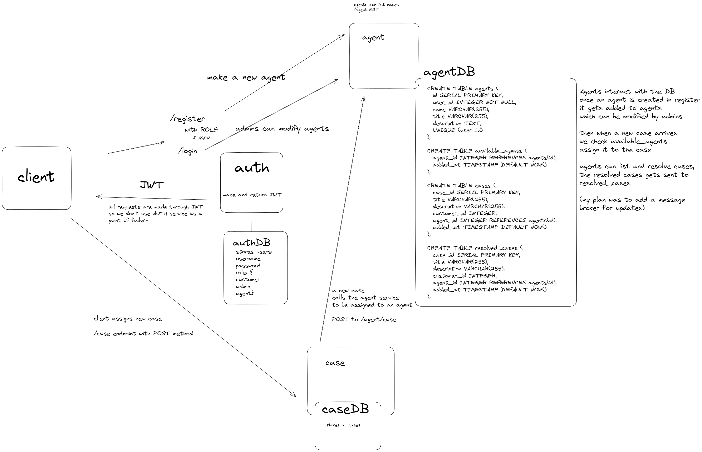

# customer-support

### Microservices based architecture w/ decentralized auth + kubernetes
Auth services implemented  
Case implemeneted  
Agent WIP (check issues)  

#### TODO list:  
finish frontend  
cleanup/reorganize the microservices(better folder structure and types/interfaces)  
add tests  
better way to run/start the project  
maybe add a getaway  
maybe add kafka

## How to run  
You need Docker and Kubernetes on your system. 
Generate a JWT secret (check ./backend/lib/utils) and save a secret.env in the ./kubernetes folder.  

Go into ./kubernetes/images, build all the images in the order it's put then inside ./kubernetes do `bash start.sh`
This will launch the different scripts inside microservices and deploy them in a kubernetes cluster.  
To stop run the stop.sh script, depending on the system you might want to run it twice.  

### Issues  
Due to problems with encoding you might need to copy/paste the scripts, check issues tab.

## Arthitecture 


### Folder Organization
Each microservice consists of ./app where the Node code resides and then ./db where the schema for the PostgreSQL db is. Then you also have Docker files to build the app and db separately, the yaml files are for kubernetes that will start the deployment, service and loadbalancer to expose the endpoints outside. The bash scripts are there to start everything up, I call these bash scripts from ./kubernetes folder.  

## Endpoints  
I wanted to include a loadbalancer that would start with /api but instead every service is just prefixed with it for now.
### Auth Service 
PORT: 3000  

POST /api/register to register the user  
POST /api/login to get the Bearer token  

Using JWT you can register 3 type of users, example:
```
{
    "username": "agent",
    "password": "password",
    "role": "agent"
}
```
The roles are customer, agent and admin. Each microservice has middleware that checks the Bearer token (which you get after loging in) through middleware you can interact with the endpoints.  

### Case Service
PORT: 4000  

GET /api


# how to use
start the agent service first, then case then auth  

3000/api/register

```
{
    "username": "customer",
    "password": "password",
    "role": "customer"
}
```  
/api/login with your credentials  
and store the bearer token in the auth header

(make sure to register an agent first)

to make a new case there needs to be an agent already
login and register as a customer then hit POST 4000/api/case
```
{
    "title": "title2",
    "description": "description2"
}
```  
an agent will be added automatically to your case